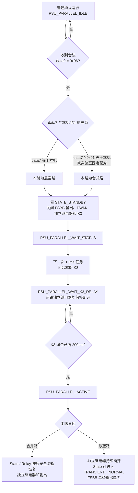

# 并联充电状态流程图

## 1. 角色定义与进入前提

- **合并路**：并机后接入电池充电回路的一路。
- **悬空路**：并机后不接入独立电池回路、经 K3 与合并路公共输出相连的一路。
- 主控仅应在合并路已经处于充电状态时下发并机命令；非充电状态下并机命令无效。
- 并机命令不会覆盖原有自动运行 `data0 = 0x00` 或被控充电运行 `data0 = 0x01` 的运行模式。

主控向同一充电器的两路分别下发 `data0 = 0x06`，两帧的 `data0` 至 `data7` 相同，`data7` 为悬空路 CAN 地址：

```text
发给合并路：06 FF FF 7F FF 7F FF <悬空路地址>
发给悬空路：06 FF FF 7F FF 7F FF <悬空路地址>
```

角色判定规则：

```text
标准客户端地址：
data7 == 本机地址       → 悬空路
data7 ^ 0x01 == 本机地址 → 合并路

实验室固定配对：
0x80 ↔ 0xBF
```

---

## 2. 进入并机流程



### K3 与独立继电器互锁

| 阶段 | FSBB 输出 / PWM | 独立继电器 | K3 并联继电器 |
|---|---|---|---|
| 收到 `data0 = 0x06` | 关闭 | 断开 | 断开 |
| 下一次 10ms 并机任务 | 保持关闭 | 断开 | 吸合 |
| K3 吸合后的 200ms | 由状态机恢复前保持关闭 | 强制断开 | 保持吸合 |
| `PSU_PARALLEL_ACTIVE` 合并路 | 按原状态机恢复 | 可按安全流程闭合 | 保持吸合 |
| `PSU_PARALLEL_ACTIVE` 悬空路 | 可由状态机恢复 | **持续断开** | 保持吸合 |

> 悬空路的独立继电器必须持续断开，但不能因此阻止悬空路进入 `TRANSIENT`、`NORMAL` 或使 FSBB 停止输出。

---

## 3. 并机状态上报

只要本路 K3 已吸合，即：

```c
Sys.unOut.u8ParRlyIsOn == 1
```

运行状态上报 `0x08`，表示本路处于并机运行状态。

当合并路和悬空路均上报 `0x08` 时，主控判定并机成功。

---

## 4. 5.1.9 电流上限处理

5.1.9 的 `data0` 为最大输出电流。软件中相关变量职责如下：

```text
5.1.9 data0
→ stCanInfo.unPsuChrgMaxIoutRx.u8MaxOutputIout
→ stCanInfo.stParallelCtrl.u8MaxOutputIout
→ Can_ParallelGetMaxOutputIout()
→ FSBB 电流限制
```

- `u8NormalMaxOutputIout`：保存普通独立运行时的最大输出电流，退出并机后恢复。
- `u8MaxOutputIout`：FSBB 当前实际采用的最大输出电流。
- 进入并机时，`u8MaxOutputIout` 由最近一次有效的 5.1.9 电流命令初始化。
- 并机运行期间，5.1.9 命令按当前并机电流限制规则更新 `u8MaxOutputIout`。
- 退出并机时，`u8MaxOutputIout` 恢复为 `u8NormalMaxOutputIout`。

---

## 5. 停止并机流程

在 `PSU_PARALLEL_ACTIVE` 状态下，按《铁塔5.0软件策略》的定义处理：

| 主控下发对象 | `data0` | 本路处理 | 对端处理 |
|---|---:|---|---|
| 合并路 | `0x00` 自动运行 | 保持并机，仅切换合并路自动运行模式 | 悬空路保持并机 |
| 合并路 | `0x01` 充电运行 | 保持并机，仅切换合并路被控充电模式 | 悬空路保持并机 |
| 合并路 | `0x03` 停机 | 合并路退出并机并受控停机 | 合并路向悬空路发送内部 `data0 = 0x00`；悬空路退出并机并进入自动运行 |
| 悬空路 | `0x00` 自动运行 | 悬空路退出并机并进入自动运行 | 悬空路向合并路发送内部退出通知；合并路仅退出并机，原运行保持不变 |
| 悬空路 | `0x03` 停机 | 悬空路退出并机并进入停机 | 悬空路向合并路发送内部退出通知；合并路仅退出并机，原运行保持不变 |

仅需要取消并机、且合并路需要保持原运行时，主控优先向**悬空路**下发自动运行 `data0 = 0x00`。

### 内部退出通知识别

内部 5.1.6 报文使用发送方电源自身 CAN 地址作为 CAN ID 源地址：

```text
悬空路 → 合并路：data0 = 0x00 或 0x03
合并路 → 悬空路：data0 = 0x00
```

接收侧仅在当前处于并机状态、报文类型为 5.1.6、目标地址为本机且源地址为当前配对路时，才接收该内部报文。

合并路收到悬空路内部退出通知后，仅清除并机状态并断开 K3；该内部通知不能进入普通 FSBB 运行命令处理，避免合并路被误切换为自动运行或停机。

---

## 6. 退出后的统一动作

无论通过哪种停止并机路径退出，执行退出的一路均执行：

```text
断开 K3
→ 清除并机状态与角色信息
→ 恢复 u8NormalMaxOutputIout
→ 后续由对应的自动运行、被控运行或停机命令驱动 State / Relay / FSBB
```
